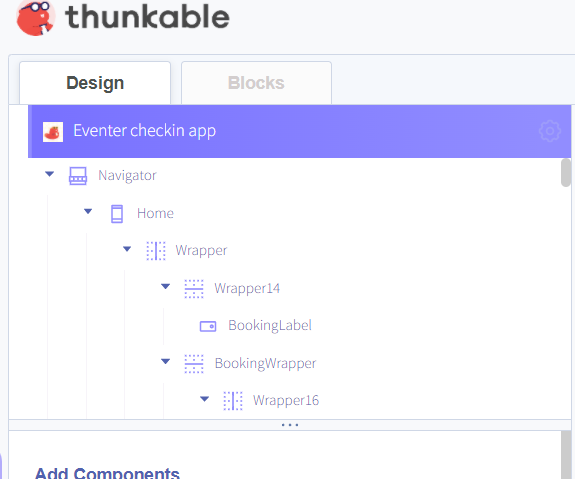
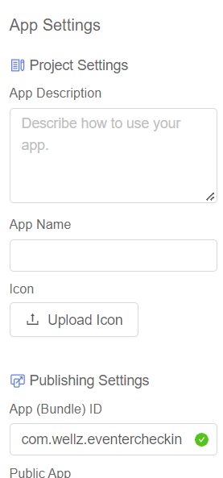
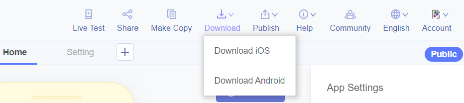
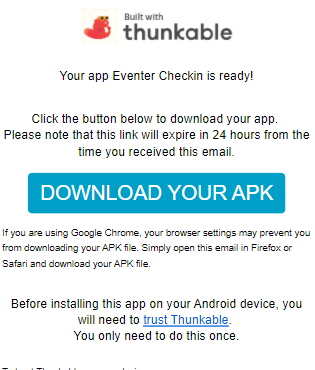
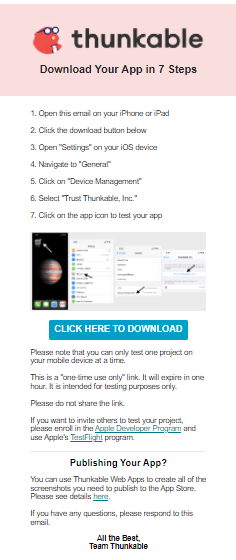

# [📘 Русский](https://github.com/Wel-lz/Eventer-checkIn-app/blob/main/README_ru.md)

# Eventer checkin app

## _App for WordPress plugin Eventer_
#### &emsp; [Developed on Thunkable](https://thunkable.com)
#### &emsp; Plugin author [Imithemes](https://eventer.imithemes.com/)

## Features

- Get booking information by booking number
- Get information about each ticket in the booking
- Registration of individual tickets
- Ability to self-customize the application (Thunkable)
- English&Russian localization

## In future versions
- Registration of the entire booking
- Ability to work with the server API via the insecure http protocol (optional)
- Ability to cancel Checkin for an individual ticket
- Breaking the line with the type of ticket in the booking into lines with separate tickets (1 each) for a completely separate Checkin
## Installation

#### Edit File `wp-content/plugins/eventer/front/eventer_rest_endpoints.php`

> The modified lines are wrapped in region mod/mod_*

   
Function eventer_application_scan_events($request = null)

    function eventer_application_scan_events($request = null)
    {
        $parameters = $request->get_json_params();
        $event = (isset($parameters['event'])) ? $parameters['event'] : '';
        $date = (isset($parameters['date'])) ? $parameters['date'] : '';
        $code = (isset($parameters['code'])) ? $parameters['code'] : '';
        if ($code != '') {
            $codes = explode("-", $code);
            $code = $codes[0];
        }
        $message = '';
        if ($event == "") {
            $message = "Sorry, there are no events to show here.";
        }
        if (date_i18n('Y-m-d', strtotime($date)) < date_i18n('Y-m-d')) {
            $message = "please select date in future";
        }
        if ($code == "") {
            $message = "No barcode found";
        }
        $registrant = eventer_get_registrant_details("id", $code);
        $eventers = array('ID' => "", 'Title' => "", 'Date' => "", 'name' => "", 'email' => "", "status" => "", "amount" => "");
        //$message = "Sorry, no details found";
        if ($registrant) {
            $registrant_email = $registrant->email;
            $ticket_id = $registrant->id;
            $amount = $registrant->amount;
            $username = $registrant->username;
            $status = $registrant->status;
            $event_date = $registrant->eventer_date;
            $event_id = $registrant->eventer;
            $user = unserialize($registrant->user_system);
            $tickets = (isset($user['tickets'])) ? $user['tickets'] : '';
            $woo = "";
            if (!empty($tickets)) {
                foreach ($tickets as $ticket) {
                    $event_woo = $ticket['event'];
                    $date_woo = $ticket['date'];
    
                    if ($event_woo == $event && date_i18n("Y-m-d", strtotime($date)) == date_i18n("Y-m-d", $date_woo)) {
                        $woo = "1";
                        break;
                    }
                    $test = (isset($parameters['test'])) ? $parameters['test'] : '';
                    if ($test != "") {
                        $woo = "2";
                        break;
                    }
                }
            }
            if ($woo == "2") {
                $tickets_info = [];
                foreach ($tickets as $ticket) {
                    if (!in_array($ticket['event'], array_keys($tickets_info))) {
                        $tickets_info[$ticket['event']] = [];
                    }
                    //
                    //$get_key = get_option('eventer-android-app-api-key');
                    //
                    $tickets_info[$ticket['event']][] = [
                        'ticket_id' => $ticket['id'],
                        'event_name' => get_the_title($ticket['event']),
                        'ticket_type' => $ticket['type'],
                        'ticket_name' => $ticket['ticket'],
                        'ticket_date' => date('d-m-Y', $ticket['date']),
                        'quantity' => $ticket['quantity'],
                        'ckechin' => $ticket['checkin']
                    ];
                }
                $eventers = array(
                    'ID' => $ticket_id,
                    'name' => $username,
                    'email' => $registrant_email,
                    "status" => $status,
                    "amount" => $amount,
                    'tickets_data' => $tickets_info
                );
            } elseif ($woo == "1") {
                $eventers = array('ID' => $ticket_id, 'Title' => get_the_title($event), 'Date' => date_i18n("Y-m-d", strtotime($date)), 'name' => $username, 'email' => $registrant_email, "status" => $status, "amount" => $amount);
            } elseif ($event_date == date_i18n('Y-m-d', strtotime($date)) && $event_id == $event) {
                $eventers = array('ID' => $ticket_id, 'Title' => get_the_title($event), 'Date' => date_i18n("Y-m-d", strtotime($date)), 'name' => $username, 'email' => $registrant_email, "status" => $status, "amount" => $amount);
            } else {
                $eventers = array('ID' => "", 'Title' => "", 'Date' => "", 'name' => "", 'email' => "", "status" => "", "amount" => "");
                $message = "Sorry, ticket do not mach with the selected event";
            }
        } else {
            $eventers = array('ID' => "abcd", 'Title' => "", 'Date' => "", 'name' => "", 'email' => "", "status" => "", "amount" => "");
            $message = "Sorry, no details found";
        }
        $response = array("scan" => $eventers, "msg" => $message);
    
        return rest_ensure_response($response);
    }

  
Function eventer_application_checkin_events($request = null)

    function eventer_application_checkin_events($request = null)
    {
        $parameters = $request->get_json_params();
        $registrant = (isset($parameters['registrant'])) ? $parameters['registrant'] : '';
        $woocommerce_events = eventer_get_settings('eventer_enable_woocommerce_ticketing');
        $registrants = eventer_get_registrant_details('id', $registrant);
        if ($woocommerce_events == 'on') {
            $tickets_updated = array();
            $ticket_exist = $date_verify = $proceed_further = '';
            $user_system = unserialize($registrants->user_system);
            $tickets = (isset($user_system['tickets'])) ? $user_system['tickets'] : array();
            if (!empty($tickets)) {
    #region mod
                if (isset($parameters['mod'])) {
                    $id_tickets_to_checkin = (isset($parameters['id_tickets_to_checkin'])) ? $parameters['id_tickets_to_checkin'] : '';
                    if ($id_tickets_to_checkin != '') {
                        foreach ($tickets as $ticket) {
                            if (in_array($ticket['id'], $id_tickets_to_checkin)) {
                                $check_checkin_status = (isset($ticket['checkin'])) ? $ticket['checkin'] : '';
                                $ticket['checkin'] = $ticket['checkin_date'] = '';
                                $ticket_exist = '1';
                                $date_verify = '1';
                                if ($ticket_exist != '' && $date_verify != '') {
                                    $proceed_further = '1';
                                    $ticket['checkin'] = '1';
                                    $ticket['checkin_date'] = date_i18n('Y-m-d H:i:s');
                                    $tickets_updated[] = $ticket;
                                }
    
                            } else {
                                $tickets_updated[] = $ticket;
                            }
                        }
                        if ($proceed_further != '' && $check_checkin_status == '') {
                            $user_system['tickets'] = $tickets_updated;
                            eventer_update_registrant_details(array('user_system' => serialize($user_system)), $registrant, array("%s", "%s"));
                            $msg = "Successfully check-in";
                        } elseif ($check_checkin_status != '') {
                            $msg = "This ticket is already checked in";
                        }
                    }
                } else {
    #endregion
                    foreach ($tickets as $ticket) {
                        $check_checkin_status = (isset($ticket['checkin'])) ? $ticket['checkin'] : '';
                        $ticket['checkin'] = $ticket['checkin_date'] = '';
                        $ticket_exist = '1';
                        $date_verify = '1';
                        if ($ticket_exist != '' && $date_verify != '') {
                            $proceed_further = '1';
                            $ticket['checkin'] = '1';
                            $ticket['checkin_date'] = date_i18n('Y-m-d H:i:s');
                            $tickets_updated[] = $ticket;
                        }
                    }
                    if ($proceed_further != '' && $check_checkin_status == '') {
                        $user_system['tickets'] = $tickets_updated;
                        eventer_update_registrant_details(array('user_system' => serialize($user_system)), $registrant, array("%s", "%s"));
                        $msg = "Successfully check-in";
                    } elseif ($check_checkin_status != '') {
                        $msg = "This ticket is already checked in";
                    }
    # region mod end bracket
                }
    # endregion
            } else {
                $msg = "It seems the ticket is not related to the details you submiited above.";
            }
        } else {
            $user_system = unserialize($registrants->user_system);
            if (isset($user_system['checkin']) && $user_system['checkin'] == '1') {
                $msg = "This ticket is already checked in";
            } else {
                $user_system['checkin'] = "1";
                $user_system['checkin_date'] = date_i18n('Y-m-d H:i:s');
                eventer_update_registrant_details(array('user_system' => serialize($user_system)), $registrant, array("%s", "%s"));
                $msg = "Successfully check-in";
            }
        }
        $response = array("scan" => "", "msg" => $msg);
    
        return rest_ensure_response($response);
    }

### &emsp;Android
#### &emsp;&emsp;Download [last release](#)

&emsp;&emsp;**or**
[**Install from source**](#source)

### &emsp;iOS
> iOS and Thunkable restrictions prevent you from getting the setup file. To obtain the application, you must independently request and receive a download link on the Thunkable website

&emsp;&emsp;[**Install from source**](#source)

## Source
1. Open [source](https://x.thunkable.com/projectPage/626133ba03db8500120752f9) at Thunkable
1. Set up a project
   1. Title/description/icon/etc...
      1. Click on the project 
      2. Enter the data 
   2. Download request and get link
      1. Click "Download" and select a platform 
      2. Receive an email with a link and installation instructions  

## Known bugs
### &emsp;Android app

### &emsp;iOS app
- On iOS versions of the application, white stripes are noticed on the top and bottom of the application. Tested on iPhone 13 (fix - not found)
- On iOS versions of the application, a bug was noticed in displaying the ticket panel (it does not critically affect the use). Tested on iPhone 13 (fix - not found)

### &emsp;Плагин eventer
- Basically, the eventer plugin does not require an API key inside requests, only inside its application (fix - ?. Perhaps I will add protection of requests with an API key in future versions)
- There is a ticket cart bug due to which tickets are duplicated/disappeared in the booking (fixed - not found)
- Tickets are not added to the basket, the checkout tab does not go (fixed - changing the theme of the site)
- Error opening (empty tab) booking (fixed - reloading the page)
